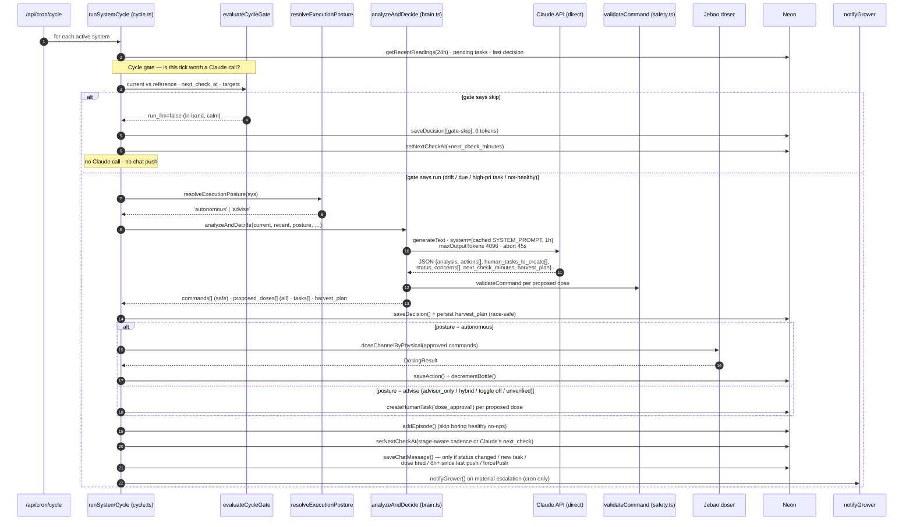
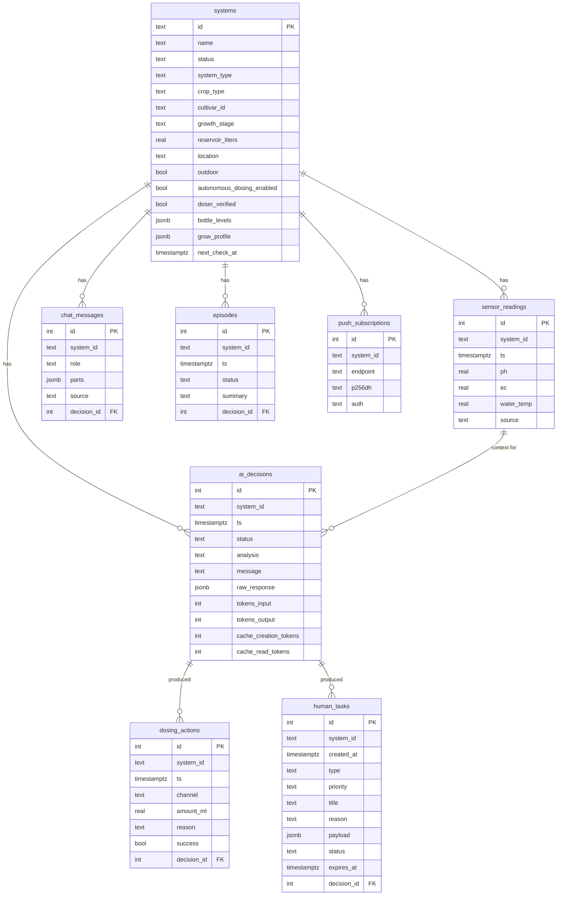
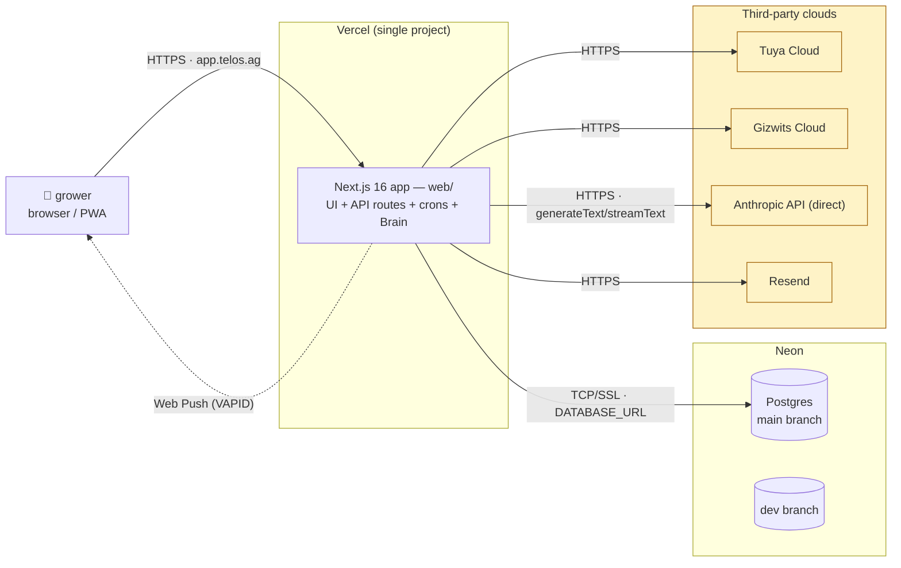

# TELOS — Architecture

מסמך תיעוד הארכיטקטורה. עודכן 2026-06-28.

> **Reframe (was "GrowK / Python agent").** TELOS is now a **single Next.js 16 (TypeScript) app** in `Code/web`, deployed on **Vercel**, with data in **Neon Postgres**. The Brain, the crons, sensor polling, chat, and the database all run **inside the web app** — there is no separate agent service. The Python service in `Code/growk/` is **LEGACY / ARCHIVED**: no Railway, no SQLite, no FastAPI in production. Earlier versions of this doc described a Python `agent/brain.py` on Railway talking to a Next.js dashboard over HTTP; that topology no longer exists. Where this doc still references `growk/` files (e.g. `agent/brain.py`) it is for historical lineage only — the live code is the TypeScript port under `web/src/lib/`.

Production domain: **https://app.telos.ag** (custom domain since 31 May 2026; the old `growk-one.vercel.app` is obsolete).

## 1. תרשים מערכת (Mermaid)

```mermaid
flowchart TB
    %% ===== Physical / Hardware =====
    subgraph PHYS["🌱 Physical (Tel Aviv, outdoor)"]
        sensor[("Tuya PH-W218<br/>8-in-1 sensor")]
        doser[("Jebao MD-4.5<br/>5-channel doser")]
        reservoir[("reservoir<br/>+ float valve")]
        nft[("NFT pipes<br/>wall-mounted")]
        sensor -.measures.-> reservoir
        doser -.injects.-> reservoir
        reservoir -.feeds.-> nft
    end

    %% ===== Cloud APIs =====
    subgraph CLOUD["☁️ Third-party Cloud APIs"]
        tuyacloud["Tuya Cloud<br/>openapi.tuyaeu.com<br/>Thing API v2.0"]
        gizwits["Gizwits Cloud<br/>usapi.gizwits.com<br/>Jebao Aqua app_id"]
        claude["Anthropic API<br/>api.anthropic.com (direct)<br/>claude-sonnet-4-6<br/>+ 1h prompt cache"]
        resend["Resend (email)"]
        webpush["Web Push (VAPID)"]
        sensor -.WiFi.-> tuyacloud
        doser -.WiFi.-> gizwits
    end

    %% ===== The web app (Next.js on Vercel) =====
    subgraph APP["▲ TELOS web app (Next.js 16 · Vercel)"]
        direction TB

        subgraph CRONS["Vercel Cron (vercel.json)"]
            cronpoll["/api/cron/poll<br/>*/15 * * * *"]
            croncycle["/api/cron/cycle<br/>17 */2 * * *"]
            cronreport["/api/cron/daily-report<br/>0 8 * * *"]
        end

        subgraph BRAINLAYER["lib/ — the Brain"]
            cycle["cycle.ts<br/>runSystemCycle()<br/>cycle gate · posture · execute · notify"]
            brain["brain.ts<br/>analyzeAndDecide()<br/>build prompt → Claude → parse → safety"]
            posture["control-mode.ts<br/>resolveExecutionPosture()<br/>SUBTRACT-ONLY gate"]
            safety["safety.ts<br/>validateCommand()<br/>hard limits"]
            notify["notify.ts<br/>notifyGrower()<br/>Web Push + email"]
            cycle --> brain
            cycle --> posture
            brain --> safety
            cycle --> notify
        end

        subgraph CHATLAYER["app/api/chat — conversational interview + companion"]
            chat["route.ts<br/>streamText + agent tools<br/>onboarding doctrine"]
        end

        subgraph UI["app/ — grower UI (RTL/Hebrew PWA)"]
            grow["/grow — hero + timeline"]
            dash["/ — overview + posture"]
            sw["public/sw.js — push SW"]
        end
    end

    %% ===== Neon =====
    subgraph N["🐘 Neon Postgres"]
        pg[("systems · sensor_readings<br/>ai_decisions · dosing_actions<br/>human_tasks · chat_messages<br/>episodes · push_subscriptions")]
    end

    %% ===== Connections =====
    cronpoll -- "Tuya read" --> tuyacloud
    cronpoll --> pg
    croncycle --> cycle
    cronreport --> notify
    brain -- "generateText<br/>cache_control 1h, 45s abort" --> claude
    cycle -- "dose (autonomous only)" --> gizwits
    cycle --> pg
    notify --> resend
    notify --> webpush
    chat --> claude
    chat --> pg
    grow --> pg
    dash --> pg

    %% ===== Styling =====
    classDef physColor fill:#e0f2fe,stroke:#0369a1,stroke-width:1px,color:#0c4a6e
    classDef cloudColor fill:#fef3c7,stroke:#a16207,stroke-width:1px,color:#713f12
    classDef appColor fill:#dcfce7,stroke:#15803d,stroke-width:1px,color:#14532d
    classDef storeColor fill:#fff,stroke:#52525b,stroke-width:2px

    class PHYS,sensor,doser,reservoir,nft physColor
    class CLOUD,tuyacloud,gizwits,claude,resend,webpush cloudColor
    class APP,CRONS,BRAINLAYER,CHATLAYER,UI,cronpoll,croncycle,cronreport,cycle,brain,posture,safety,notify,chat,grow,dash,sw appColor
    class N,pg storeColor
```



## 2. מחזור החלטה (Sequence)

The Brain loop is `/api/cron/cycle` → `runSystemCycle()` (`web/src/lib/cycle.ts`) → `analyzeAndDecide()` (`web/src/lib/brain.ts`). The **same** `runSystemCycle()` also runs on a grower action (confirming a dose, answering a question) via `reevalSystem()` — `force: true` to bypass the gate, `forcePush: true` to always acknowledge. That single re-derivation path is the synchronisation contract: the latest `ai_decisions` row, the pushed chat message, the episode line, and any new Human Tasks are all produced here.



## 3. הארכיטקטורה ב-4 שכבות

| # | שכבה | אחריות | מודולים (live = `web/src/lib`) |
|---|---|---|---|
| 1 | **Hardware abstraction** | מסך כל חיישן/אקטואטור מאחורי שכבת מכשירים. Tuya לקריאה, Jebao/Gizwits לדישון, עם בדיקת binding חיה. | `lib/devices/jebao.ts`, Tuya read path, `confirmSensorBinding` / `confirmDoserBinding` |
| 2 | **Safety + posture** | שני שערים. (א) `resolveExecutionPosture` — האם בכלל מותר לירות משאבה (subtract-only). (ב) `validateCommand` — גבולות קשיחים על כל מנה שעוברת. | `lib/control-mode.ts`, `lib/safety.ts` |
| 3 | **AI Brain** | בונה prompt עשיר (חלונות סטטיסטיים, פרופיל גידול, זיכרון, מלאי בקבוקים, יעדים), שולח ל-Claude ישירות (cached), מפענח JSON, מסנן דרך safety, יוצר Human Tasks עם dedup, מעדכן harvest_plan. | `lib/brain.ts`, `lib/cycle.ts`, `lib/prompt-engine.ts`, `lib/cycle-gate.ts` |
| 4 | **UI / Chat / Notify** | חשיפה ל-grower: dashboard עברית RTL, מסך Grow + timeline, צ'אט (companion + onboarding), PWA + Web Push, אימייל. | `app/` (Next.js), `app/api/chat/route.ts`, `lib/notify.ts`, `public/sw.js` |

**+ Human Task Queue (חוצה שכבות):** הברein יוצר tasks למשתמש כשפעולה נדרשת מחוץ ליכולתו — `water_change`, `dose_approval`, `system_reset`, `question`, `manual_action`. Dedup דו-שכבתי (pending-of-type + recent-within-window) ב-`brain.ts` וב-`cycle.ts`, persistence ב-Neon, חשיפה ב-UI ובצ'אט.

## 4. ה-Brain loop בפירוט

### 4.1 שתי דרכי כניסה, מסלול אחד (`runSystemCycle`)
- **Cron** (`source: 'cron'`) — tick מתוזמן; מכבד את ה-cycle gate (מדלג על ticks זולים, משתיק רעש בצ'אט).
- **Grower action** (`reevalSystem`, `force: true`) — אישור מנה / מענה לשאלה; עוקף את ה-gate (העולם השתנה) ותמיד מנתח מחדש + דוחף הודעת אישור (`forcePush: true`, `suppressNewQuestions: true` כדי לא לחקור מחדש את מי שבדיוק ענה).

### 4.2 ה-Cycle gate (`lib/cycle-gate.ts`)
לפני כל קריאת Claude, `evaluateCycleGate` מחליט אם ה-tick שווה את העלות. מצב רגוע, in-band, ולפני `next_check_at` → **skip**: נכתבת שורת `ai_decisions` עם 0 טוקנים (כדי שהיומן יראה שהיינו חיים), אבל **אין** קריאת Claude ו**אין** הודעת צ'אט. drift / משימה ב-high-pri / סטטוס לא-healthy / הגיע `next_check_at` → **run**.

### 4.3 Stage-aware cadence (`proactiveReviewMinutes`)
כשהכל רגוע ובריא ולא נעשתה פעולה, ה-tick הזה היה PROACTIVE REVIEW. ה-cadence הבא תלוי-שלב כדי שהברein ינווט באופן פעיל בלי לשרוף compute כל שעתיים:
- `seedling` → 360 דק' (~4×/יום) · `flowering` → 360 (~4×/יום) · `fruiting` → 480 (~3×/יום) · `vegetative` ושאר → 720 (~2×/יום).
אם לעומת זאת הסטטוס לא-healthy או נעשתה פעולה, מכבדים את `next_check_minutes` הקצר של Claude.

### 4.4 הקריאה ל-Claude (`analyzeAndDecide`, `lib/brain.ts`)
- **ישירות ל-Anthropic** — `createAnthropic({ baseURL: "https://api.anthropic.com/v1" })`, **לא** gateway.
- מודל `claude-sonnet-4-6` (override ע"י `CHAT_MODEL`).
- `SYSTEM_PROMPT` נשלח עם `cacheControl ttl: "1h"` (beta `extended-cache-ttl-2025-04-11`) → cache חם בין מחזורים.
- `maxOutputTokens: 4096` (2048 היה חותך את ה-JSON באמצע על מערכות עשירות), `abortSignal: AbortSignal.timeout(45_000)` (fail-fast כדי שמערכת אחת איטית תיפול ל-fallback במקום להפיל את כל ה-cron ב-504).
- ה-prompt מוזרק בהקשר עשיר: חלונות סטטיסטיים, dosing config, fertilizer profile, priming state, bottle status + תחזיות, tolerance bands + diurnal, grow profile, **Grower Memory**, **Episodes**, ו-cultivar record.
- כל כשל (API / parse / truncation) נופל ל-`fallback()` שמחזיר סטטוס `attention`, `next_check_minutes: 5`, ולא יוצר אף פעולה.

## 5. ה-control_mode invariant — SUBTRACT-ONLY (`lib/control-mode.ts`)

**ה-invariant שלעולם לא נשבר:** `control_mode` הוא אך ורק **subtract-only gate term**. הוא יכול לנתב כל המלצה למשימה (`dose_approval`), אבל הוא **לעולם לא** יכול להדליק משאבה. אוטונומיה דורשת **שלושה שערים עצמאיים, כולם true**:

```
posture === 'autonomous'  ⇔  control_mode === 'brain_doser'
                              AND autonomous_dosing_enabled === true   (master toggle, UI-only)
                              AND doser_verified === true              (verification protocol passed)
```

`resolveExecutionPosture(sys)` מחזיר `'autonomous'` רק כשכל השלושה מתקיימים, אחרת `'advise'`. `hybrid` נדחה ומטופל כ-`advise` עד שמעטפת הבטיחות שלו תיבנה. `effectiveControlMode` מבצע backfill בטוח למערכות שהוקמו לפני שהשדה קיים (מערכת שכבר אוטונומית קוראת כ-`brain_doser`, אחרת `advisor_only`) — כך שהוספת השדה הייתה no-op מיום אחד.

ב-`cycle.ts`, אם `posture !== 'autonomous'` כל מנה מוצעת (`proposed_doses` — **כל** מה שהברein המליץ, לא רק ה-`commands` שאושרו ע"י safety) הופכת ל-`dose_approval` Human Task (priority high, expiry 24h כדי לשרוד לילה, dedup פר-ערוץ). הברein מקבל את ה-posture ה**אפקטיבי** דרך `autonomous_dosing_enabled: posture === 'autonomous'`, כך שב-advisor_only הוא נכון מנסח "אני ממליץ, אתה מבצע" ולא מצפה לביצוע. Keying על posture (לא על ה-toggle הגולמי) הוא מה שמבטיח שבחירת `advisor_only` של המגדל לעולם לא תיעקף — המצב הוא השומר החיצוני.

## 6. Onboarding — ראיון שיחתי אחד מסודר (`app/api/chat/route.ts`)

Onboarding הוא **ראיון שיחתי אחד, מסודר**, לא רצף שלבים ממוספר בקוד. לחיצה על **"New System"** *היא* תחילת ה-onboarding — אין signup נפרד (admin יחיד, אין users). ה-route מזהה מערכת טרייה (`name === "מערכת חדשה"` ואין readings/decisions) ומזריק בלוק `FRESH SYSTEM — ONBOARDING REQUIRED` לסוף ה-system prompt; מאותו רגע התפקיד היחיד של הברein הוא לבנות את פרופיל הגידול, **שאלה אחת לכל תור**.

עקרונות: שאלה אחת לכל תור → persist → ack של מילה אחת → השאלה הבאה. CARD (`askGrower` עם options + `allow_free_text: true` לדומיינים פתוחים) לבחירות סגורות; טקסט עברי רגיל לפרוזה/מספרים. אף פעם לא שואלים שוב מה שכבר ידוע (`getGrowProfile`). "Decompress, don't interrogate" — המגדל נותן תשובה קצרה והברein מרחיב אותה מול טבלאות הידע.

**הצומת — control_mode (step 3).** השאלה "איך תרצה שאני אעבוד?" עם שתי אפשרויות: `brain_doser` ("מצב אוטונומי מוחלט") או `advisor_only` ("מצב ידני"). תשובה זו מסעפת את שאר הראיון:
- **AUTONOMOUS (`brain_doser`)** → readiness פיזי → `markSetupComplete` → `pollSensorNow`, ואז **doser verification** מסודר: `confirmDoserBinding` (לנקוב בשם הדוזר) → `declareBottleLevels` → `runDoserProtocol` (prime + טיפת 1ml לערוץ) → אישור ויזואלי → `verifyBottleLevels` → `markDoserVerified`. ואז מסבירים שעדיין צריך להעביר ידנית את ה-master toggle מ"ידני" ל"אוטונומי" — הברein לא יכול להדליק אותו בעצמו.
- **MANUAL (`advisor_only`)** → readiness פיזי → `markSetupComplete` → `pollSensorNow`, **בלי** פרוטוקול דוזר. ואז **notifications** (CARD: push / email / both / none → `recordGrowProfile`); אם push/both → `requestNotificationOptIn` במקום, כי במצב ידני קבלת המשימה היא הקריטית.

שני המסלולים מסיימים ב: **reflect-back** (5 שורות, "נכון?") → **baseline lock** (`recordGrowProfile({ mark_complete: true })`). השדות נשמרים כ-JSONB מוטיפס ב-`systems.grow_profile` (ראה `lib/grow-profile.ts`). `control_mode` ב-grow-profile הוא **advisory** — שער הביצוע האמיתי נשאר `autonomous_dosing_enabled × doser_verified` (ראה §5).

## 7. תת-מערכות שנשלחו

### 7.1 Notifications — Web Push + email (`lib/notify.ts`)
`notifyGrower(systemId, subject, text)` מגיע למגדל **מחוץ לאפליקציה** בשני ערוצים, כל אחד מגודר עצמאית ולא זורק:
- **Web Push (PWA):** VAPID (public key ב-`NEXT_PUBLIC_VAPID_PUBLIC_KEY`, private ב-`VAPID_PRIVATE_KEY` server-only), subscriptions ב-`push_subscriptions`, ה-service worker ב-`public/sw.js`. שולח לכל מכשיר רשום, גוזם subscriptions מתים (410/404). No-op כש-`VAPID_PRIVATE_KEY` לא מוגדר.
- **Email (fallback):** דרך Resend's HTTP API ישירות (בלי SDK). No-op כש-`RESEND_API_KEY` או `ALERT_EMAIL_TO` לא מוגדרים.

ב-`cycle.ts`, אימייל/push נשלח רק על escalation מהותי (cron בלבד): מעבר סטטוס ל-warning/critical, משימה high/urgent חדשה, או `dose_approval` חדש לביצוע ידני. התנאים מבוססי-שינוי כך שמצב critical יציב לא שולח כל מחזור.

### 7.2 Hardware confirmation (binding)
- **`confirmSensorBinding`** מבצע **קריאה חיה מ-Tuya** (לא מהמטמון) ונוקב בשם החיישן כדי שהמגדל יאשר שהוא שלו; מזהה במפורש את המקרה **"IoT Core subscription expired"** — בלי זה החיישן ייראה "מחובר" בעוד שהקריאות מתות.
- **`confirmDoserBinding`** מאתר ונוקב את ה-Jebao הקשור (Gizwits) כך שהמגדל מאשר שהדוזר הנכון מוקצה, לפני כל הצהרת בקבוקים או טיפות אימות.
הברein לעולם לא טוען שחיישן/דוזר "מחובר" בלי האימות החי הזה, ואומר בכנות אם הוא offline או שאף אחד לא bound.

### 7.3 Cron schedule + cycle gate (`web/vercel.json`)
שלושה crons:
- `/api/cron/poll` — `*/15 * * * *` — דגימת חיישן (Tuya read → `sensor_readings`).
- `/api/cron/cycle` — `17 */2 * * *` — ה-Brain loop (`runSystemCycle` לכל מערכת פעילה, דרך ה-cycle gate).
- `/api/cron/daily-report` — `0 8 * * *` — דו"ח יומי.
ה-cadence הצנום הזה + ה-cycle gate + ה-stage-aware re-engagement הם תקציב ה-compute: לא לשרוף קריאות Claude כשהכל רגוע, להתעורר מיד על drift.

### 7.4 Baseline lock (`grow_profile.baseline`)
ב-`mark_complete` ננעל snapshot **בלתי-משתנה** של ה-onboarding (`GrowBaseline`: `locked_at`, `inputs` שנפתרו, `recommended` targets קפואים) — העוגן ש-כל החלטה מאוחרת וה-case study נמדדים מולו.

### 7.5 Grower Memory + Episodes
- **Grower Memory** (`getGrowerMemory`) — מה שהמגדל לימד את הברein על הגידול הזה; מוזרק לכל prompt.
- **Episodes** (`addEpisode` / `getRecentEpisodes`) — יומן נרטיבי קומפקטי שהברein כותב בעצמו בכל מחזור ראוי לציון (מדלג על healthy-no-op), כך שמחזורים עתידיים יש להם רציפות מעבר לחלון הפעולות של 24 שעות. הסיכום בעברית כי הוא צף ל-grower (Grow hero / activity).

### 7.6 Dashboard / chat / nav / PWA
- מסך **`/`** (overview) מציג את ה-posture (autonomous vs advise) הנגזר מ-§5.
- מסך **`/grow`** — hero + timeline (`deriveTimeline` עד שהברein מתחזק `grow_profile.timeline` מאוחסן).
- **Chat** (`app/api/chat/route.ts`) — אותו companion שמבצע onboarding; `streamText` עם agent tools, `stepCountIs(8)`, system prompt cached 1h, היסטוריה חתוכה ל-40 תורים, מודל `claude-sonnet-4-6`. דוקטרינת confidentiality: ה-Brain לא חושף tools / cycle / DB / thresholds / vendor.
- **nav** — שורה אחת צנומה; container רוחב `--page-max`.
- **PWA** — `public/sw.js` ל-Web Push (§7.1).

### 7.7 Harvest plan (`grow_profile.harvest_plan`, type `HarvestPlan`)
ה-OPTIMAL HARVEST המתוכנן: הברein מתחזק אותו (קובע/מגלגל את `next_date` ממודל הקציר של ה-cultivar + שלב), `/grow` מציג, והברein פותח prep heads-up + execution task סביב `next_date`. `analyzeAndDecide` יכול לפלוט `harvest_plan` בכל מחזור; `cycle.ts` מתמיד אותו ב-**key-level write race-safe** (`mergeGrowProfileKey`). **אם המגדל הזיז את התאריך** (`grower_moved_at` set), התאריך שלו הוא המקור היחיד לאמת — ה-cron שומר עליו ומקבל רק את ה-instructions/note/mode של הברein. זה מה שעוצר את ה-cron מלאפס את הקציר ל"היום" אחרי שהמגדל דחה אותו בצ'אט.

## 8. מודל הנתונים (Neon Postgres)

כל הטבלאות חיות ב-**Neon** (production). `system_id` בכל טבלה מההתחלה — תמיכה ב-multi-system בלי מיגרציה.



> `grow_profile` הוא JSONB מוטיפס (ראה `lib/grow-profile.ts`) המחזיק את כל פלט ה-onboarding: `control_mode`, `water_baseline`, `nutrient_brand`, `harvest_plan`, `timeline`, `baseline` הנעול, ו-`onboarding_completed_at`. הוא מתעדכן ברמת-מפתח (`mergeGrowProfileKey`) כדי לא לדרוס מהלך מקבילי של המגדל מהצ'אט.

## 9. תזרים מידע — תרחישי ליבה

### תרחיש: דגימת חיישן (כל 15 דקות)
```
/api/cron/poll → Tuya read (live) → WaterReading → save to sensor_readings (Neon)
```

### תרחיש: מחזור החלטה (כל שעתיים ב-:17)
```
/api/cron/cycle → for each active system → runSystemCycle()
  → expireOldTasks · getRecentReadings(24h) · pending tasks · last decision
  → evaluateCycleGate → (skip: 0-token decision row, no Claude, no push)
                        (run: ↓)
  → resolveExecutionPosture (subtract-only)
  → analyzeAndDecide → Claude (direct, cached, 45s abort)
     → JSON {actions, human_tasks_to_create, status, concerns, next_check_minutes, harvest_plan}
  → validateCommand per proposed dose (safety filter)
  → saveDecision + persist harvest_plan (race-safe)
  → posture==='autonomous' ? doseChannelByPhysical + saveAction + decrementBottle
                           : createHumanTask('dose_approval') per proposed dose
  → addEpisode (skip boring) · setNextCheckAt (stage-aware) · saveChatMessage (if material)
  → notifyGrower on escalation (Web Push + email)
```

### תרחיש: פעולת מגדל (אישור מנה / מענה לשאלה)
```
UI / chat action → reevalSystem(systemId) → runSystemCycle(force:true, forcePush:true)
  → bypass gate · re-analyse · push chat acknowledgement · suppress new questions
```
כל המשטחים (Brain analysis המוצג, הודעת הצ'אט, ה-episode, משימות חדשות) נגזרים מחדש מההחלטה הטרייה במקום להציג snapshot מה-tick של לפני שעתיים.

## 10. Deployment topology



**Network boundaries:**
- Browser/PWA ↔ Vercel: HTTPS (`app.telos.ag`).
- Vercel ↔ Neon: TCP/SSL via `DATABASE_URL`.
- Vercel ↔ Anthropic / Tuya / Gizwits / Resend: outbound HTTPS — **direct**, no gateway, no separate agent service.
- Vercel → browser: Web Push (VAPID), email via Resend.

> **Legacy (do not deploy):** `Code/growk/` — the Python agent (`agent/brain.py`, `api/server.py` FastAPI, SQLite, the `main.run_loop`). It is the lineage of today's TypeScript Brain and is kept for reference only. There is **no Railway**, no FastAPI, no SQLite in production.

## 11. עקרונות מפתח

1. **One app, no gateway.** הברein, ה-crons, ה-DB וה-chat רצים בתוך אותה אפליקציית Next.js על Vercel; Claude נקרא ישירות. אין שירות agent נפרד.
2. **Subtract-only safety.** `control_mode` יכול רק לנתב מנה למשימה, לעולם לא להדליק משאבה. אוטונומיה = שלושה שערים עצמאיים true (§5). מצב המגדל הוא השומר החיצוני.
3. **Safety isolated from intelligence.** ה-AI מציע, `validateCommand` אוכף גבולות קשיחים; גם אם Claude נופל, ה-fallback לא יוצר אף פעולה.
4. **Observe, then act — but actively steer.** דגימה כל 15 דק', ניתוח כל שעתיים מאחורי ה-cycle gate; כשרגוע, re-engagement תלוי-שלב כדי לנווט באופן פעיל בלי לשרוף compute.
5. **Cache-aware + fail-fast.** `SYSTEM_PROMPT` cached 1h; `45s abort` כדי שמערכת איטית אחת תיפול ל-fallback במקום להפיל את כל ה-cron.
6. **One re-derivation path.** `runSystemCycle` הוא המקור היחיד למצב הברein — cron ופעולת מגדל כאחד — כך שכל משטח (decision מוצג, צ'אט, episode, tasks) תמיד מסונכרן.
7. **Reach the grower out-of-app.** Web Push + email דרך `notifyGrower`, מגודרים עצמאית, על escalation מהותי בלבד.
8. **Multi-system ready by design.** `system_id` בכל שורת DB מההתחלה.
