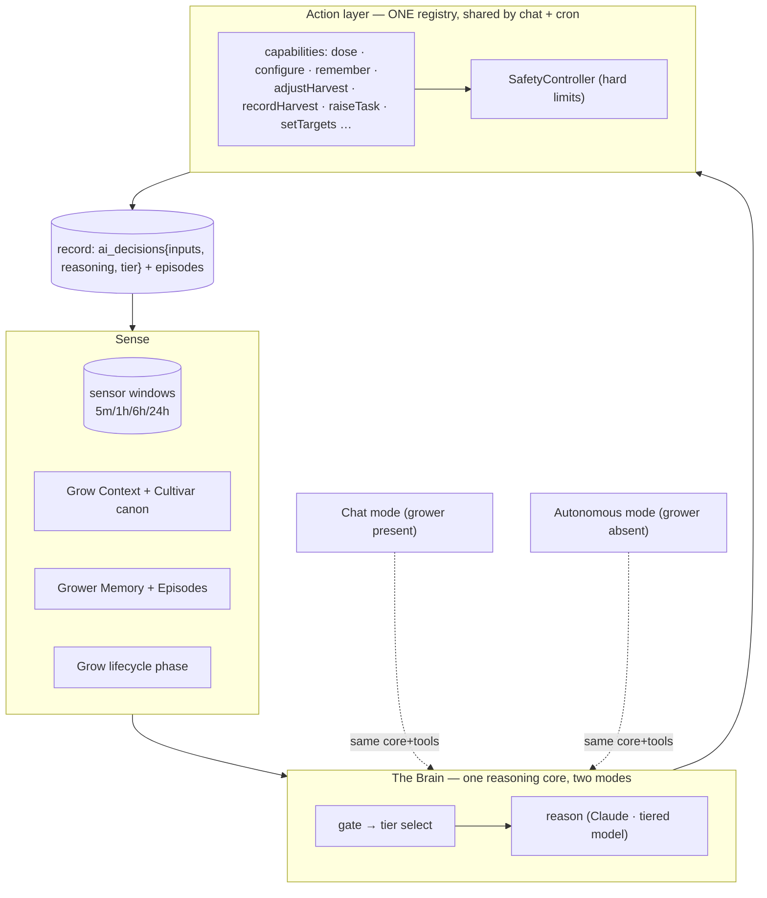
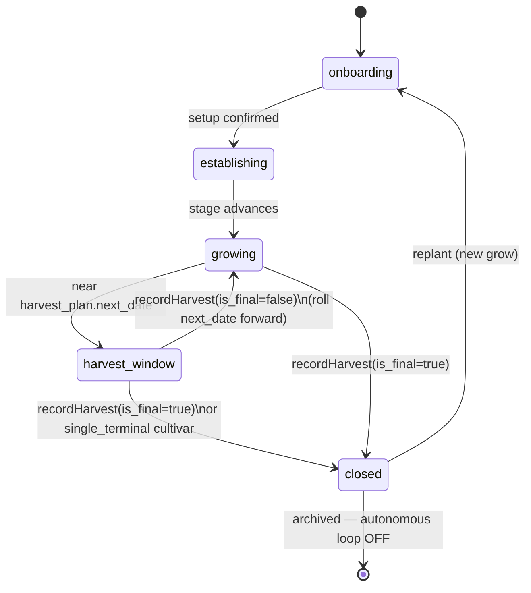

# TELOS — Brain Architecture v2: One Brain, a Lifecycle, and a Memory of Why

> Companion to `ARCHITECTURE.md` (current system map) and `NEXTGEN-ARCHITECTURE.md`
> (the knowledge-layer iteration). This document addresses the **structural** gaps
> that surface as "plot holes": a grow that never ends, two disconnected actors,
> decisions with no recorded rationale, and one model for every job. Written
> 2026-06-19.

---

## 0 · The one diagnosis everything else hangs on: **there are two brains**

The single most important architectural fact today is that TELOS runs **two
independent reasoning agents that barely talk to each other**:

| | **Chat Brain** | **Autonomous Brain** |
|---|---|---|
| Entry | `app/api/chat/route.ts` → `lib/agent-tools.ts` | `lib/cycle.ts` → `lib/brain.ts` |
| Capabilities | ~25 **tools**, acts directly (dose, configure, remember, move harvest…) | one **JSON** blob: `actions[]` + `human_tasks[]` + `harvest_plan`. **No tools.** |
| State | stateful through the DB | stateless snapshot each tick |
| Can it close a grow? remember a fact? configure dosing? | yes | **no** |

They communicate **only** through DB side-tables (`grower_memory`, `grow_episodes`,
`human_tasks`, `grow_profile`). There is no shared **action layer** and no shared
**capability set**. So an event the Chat Brain understands (a harvest) cannot
change what the Autonomous Brain *does* — at best it leaves a memory string the
Autonomous Brain can read but **cannot act on**.

Everything below is a consequence of this split. The fix is to make the Brain
**one** thing — a single reasoning core over a single, safety-gated action layer —
that runs in two *modes* (grower-present = chat; grower-absent = autonomous),
rather than two agents with different powers.

---

## 1 · The five plot holes (grounded in the code)

### 1.1 A grow has no end — the harvest bug
- The cron runs every `active` system: `listSystems().filter(s => s.status === "active")`
  (`app/api/cron/cycle/route.ts:37`).
- A grow leaves `active` **only** via `archiveSystem()` (`lib/db.ts`) — which **nothing
  on the harvest path ever called**.
- The Chat Brain had **no tool** to record a harvest. `adjustHarvestPlan`
  (`lib/agent-tools.ts`) only *moves a date*; it never ends the grow.
- `HarvestPlan.mode` already distinguishes `single_terminal` (a final reaping) from
  `cut_and_come_again`/`repeated_pick` — but no state transition consumed it.
- **Result:** "ביצעתי קטיף סופי" → at most a memory note → the system stays `active`
  → the cron keeps polling, deciding and nagging a grow that is physically over.
  This is the reported "a week after the final harvest it was still bothering me."

> **Fixed in this change** — see §6.

### 1.2 Two capability sets (the root split, §0)
The Autonomous Brain structurally cannot do most of what Chat can. There is no
single source of truth for "what the Brain can do."

### 1.3 Decisions record *what*, not *why-from-what*
- `ai_decisions` stores `analysis` (free text), `message`, `raw_response`, tokens
  (`lib/db.ts` / `saveDecision`). The `/decisions` page renders status, analysis,
  actions, tasks, concerns.
- **Missing: the structured _influences_** — which tolerance bands were in force,
  which memory entries weighed in, the drift delta, the cultivar stage, bottle
  state, and *what woke the gate*. The reasoning is only prose; the inputs that
  produced it are not captured.
- **Worse: Chat-driven decisions never reach the decision log.** `executeDose` logs
  to `dosing_actions` with `ai_status='chat'` but writes **no** decision row with a
  rationale. Half the Brain's significant choices are invisible to the audit trail.

### 1.4 One model for every job
- Chat, the autonomous cycle, and the daily report all use
  `process.env.CHAT_MODEL || "claude-sonnet-4-6"` (`lib/brain.ts:147`,
  `app/api/chat/route.ts`).
- The `cycle-gate` already decides *whether* to spend an LLM call — but never *which*
  model. There is no lightweight routine tier and no heavy "refinement" tier for the
  decisions that actually matter.

### 1.5 The architecture isn't truly visible or admin-gated
- `/architecture` exists but is hidden behind `NEXT_PUBLIC_SHOW_ARCHITECTURE=1` — a
  **build-time public flag, not auth** — and is a hand-maintained `BLOCKS[]` array
  that drifts (it said "v0.3", had no lifecycle).

---

## 2 · Target architecture

### 2.1 One Brain over a shared, safety-gated action layer



**The move:** lift the capabilities out of `agent-tools.ts` into one **capability
registry** that both the chat route and the autonomous cycle consume. Same tools,
same `validateCommand` gate, same decision-recording. Chat and cron become two
*callers* of one Brain, differing only in (a) whether a human is present and (b)
which model tier they default to — **not** in what the Brain can do.

The reasoning loop, made explicit and observable:
```
gate → tier-select → retrieve → reason → validate(safety) → act → record → remember
```

### 2.2 Grow lifecycle — a real state machine



- `status` (active/paused/archived) stays the coarse DB flag the cron filters on.
- `phase` (onboarding→…→closed) is the agronomic state the Brain reasons about.
- `closed` ⇒ `status='archived'` ⇒ the cron stops picking the system up.
- **Closing is the question, not the assumption:** when it's ambiguous whether a
  harvest was the *final* one, the Brain asks ("לסגור את הגידול או ממשיכים?")
  before archiving — closing stops everything, so it is never guessed.
- **Replant** re-opens a fresh grow on the same rig (future track — see §4).

### 2.3 The decision record — bring back the "why", structured

Extend `ai_decisions` so every significant decision carries:
- **`inputs`** (JSONB) — the snapshot that *influenced* it: sensor windows, the
  effective tolerance bands, drift vs. reference, cultivar + stage, bottle state,
  the IDs of the memory entries that weighed in, and **the gate trigger that woke
  this cycle** (drift / out-of-band / critical / cadence / pending task).
- **`reasoning`** — the rationale, separate from the grower-facing `message`.
- **`tier`** — which model decided (see §2.4), with token + cost accounting.
- **Chat decisions count too:** a significant chat action (a dose, a config change,
  a harvest) writes an `ai_decisions` row with its `inputs`/`reasoning`, so the log
  is the *whole* Brain's record, not just the cron's. Routine chatter does not.

`/decisions` then shows, per significant decision: **what influenced it** and **why**.

### 2.4 Tiered models — light in the routine, heavy at the hinges

The gate already classifies the trigger; let it also pick the **tier**:

| Trigger | Tier | Model (default) | Rationale |
|---|---|---|---|
| Routine proactive review, in-band | **light** | Haiku | cheap, frequent, low-stakes |
| Daily-cadence review | **heavy** | Sonnet/Opus | a deliberate once-a-day deep look |
| Drift / out-of-band / critical | **heavy** | Sonnet/Opus | a real excursion deserves the smart model |
| Conflict / mismatch (parameters moved, light flagged low-confidence) | **heavy** | Sonnet/Opus | the "מקצה שיפורים" pass |

Optional **escalation**: the light tier may emit `needs_review: true` (low
confidence / detected conflict) and the gate re-runs the same cycle on the heavy
tier. Model IDs live in config (`BRAIN_MODEL_LIGHT` / `BRAIN_MODEL_HEAVY`), never
hard-coded, so tiers move without a code change.

### 2.5 Architecture visibility — live, and admin-gated for real

- Replace the build-time `NEXT_PUBLIC_SHOW_ARCHITECTURE` flag with **real admin
  gating** (server-checked role, not a public env var baked into the bundle).
- Keep the page's block map, but feed it **live state** where it matters: the
  current grow `phase`, recent decisions with their `inputs`/`reasoning`, and the
  model-tier mix. The page becomes a decision-support surface, not a static poster.
- The IP-confidentiality doctrine is unchanged: this surface is owner/admin-only.

---

## 3 · Data-model deltas (concrete)

- **`systems`** — no new status values; `phase` is derived from
  `setup_completed_at` + `growth_stage` + `harvest_plan.completed_at` (no migration
  needed for the lifecycle fix). A stored `phase` column is optional later.
- **`grow_profile.harvest_plan.completed_at`** (✅ this change) — stamped when a
  terminal harvest closes the grow; `next_date` cleared. Every surface reads it.
- **`ai_decisions.inputs` JSONB + `ai_decisions.reasoning` TEXT + `ai_decisions.tier`
  TEXT** (planned, §2.3) — additive `ADD COLUMN IF NOT EXISTS`, matching the
  existing lazy-migration pattern in `ensureSchema()`.
- No change to `sensor_readings`, `dosing_actions`, `human_tasks`, `grower_memory`,
  `grow_episodes`.

---

## 4 · Sequenced workstreams

1. **Grow lifecycle close** — ✅ shipped (§6). The live bug.
2. **Decision record** — ✅ shipped (§7): `inputs` (influences) + `decision_source`
   on `ai_decisions`, populated by `cycle.ts` from what it already holds (gate
   trigger, live reading, drift, bands, cultivar/stage, authority, low bottles,
   pending count), surfaced on `/decisions`. **Remaining:** a `tier` column (with
   WS3) and writing a decision row for significant *chat* actions.
3. **Tiered models** — ✅ shipped (§8): gate returns a `tier`; `brain.ts` selects
   the model from config; the tier is recorded; light→heavy escalation (the
   refinement round) runs when the light pass wants to act.
4. **Shared capability registry** — 🟡 started (§10): the dose action — the most
   safety-critical, and the one that lived in three divergent copies — is unified
   into one gated primitive (`lib/dose-executor.ts`) that chat, cron, and the
   approval route all call. Remaining: lift the rest of the capabilities
   (recordHarvest / rememberFact / raiseTask …) into the registry so the cron can
   invoke them too.
5. **Admin-gated live architecture surface** — real auth; live phase + decisions.
6. **Replant** — a `closed` grow can spawn a fresh grow (new lifecycle, reusing
   rig config) instead of needing a brand-new system.

Generic mechanisms first; the flagship-cultivar end-to-end run (per
`NEXTGEN-ARCHITECTURE.md` §4) layers on top.

---

## 5 · Principles (carried forward)

1. **One Brain, two modes** — chat and cron are callers of one reasoning core over
   one action layer, not two agents with different powers.
2. **Safety is isolated from intelligence** — every action, from either mode, passes
   `validateCommand`. Unchanged and non-negotiable.
3. **A grow has a beginning and an end** — the lifecycle is explicit; a final
   harvest closes it; closing is asked, not assumed.
4. **Significant decisions are auditable** — influences + reasoning + tier are
   recorded, for the cron *and* for chat.
5. **Spend compute where it matters** — light in the routine, heavy at the hinges.

---

## 6 · Shipped in this change — the grow lifecycle close

The live bug from §1.1 is fixed:

- **`lib/grow-lifecycle.ts`** (new) — the lifecycle phases + a pure
  `resolveHarvestOutcome(mode, is_final, cadence)` that decides **close vs.
  continue**: `single_terminal` or `is_final=true` → close; otherwise roll the next
  harvest forward by the cultivar cadence (weekly default).
- **`recordHarvest` tool** (`lib/agent-tools.ts`) — turns "ביצעתי קטיף" from a chat
  note into a real transition. On **close** it: dismisses all pending tasks
  (`dismissAllPendingTasks`), stamps `harvest_plan.completed_at`, logs an episode,
  and calls `archiveSystem` — which **stops the autonomous loop** (the cron only
  runs `active` systems). On **continue** it rolls `harvest_plan.next_date` forward,
  supersedes the now-done harvest task, and logs the episode. Always records the
  grower's harvest note as an `observation` (outcome feedback for the Brain).
- **`lib/db.ts`** — `dismissAllPendingTasks(systemId, reason)` (honest `dismissed`).
- **`grow-profile.ts`** — `HarvestPlan.completed_at`; `deriveTimeline` renders a
  completed harvest as `done`, not `planned`.
- **`app/api/chat/route.ts`** — when `status='archived'` the agent is told the grow
  is CLOSED: it stops monitoring/dosing, answers from history, and offers to open a
  new grow at replant. Prompt now documents `recordHarvest` vs. `adjustHarvestPlan`
  and the "ask before closing if unsure" rule.
- **`/architecture`** — a `grow-lifecycle` block so the map stays honest.

## 7 · Shipped in this change — the decision record (influences)

§1.3's gap — decisions recorded *what* but not *why-from-what* — is closed for the
autonomous path:

- **`lib/decision-inputs.ts`** (new) — `buildDecisionInputs(...)` assembles a
  structured **influence snapshot** from data the cycle already holds (no extra DB
  round-trips): the gate **trigger** that woke the cycle, the live reading + age,
  **drift** vs. the last decision, the effective **tolerance bands**, the
  **cultivar + stage**, **execution authority** (autonomous vs. manual), **low
  bottles**, and the **pending-task** count.
- **`ai_decisions.inputs` JSONB + `ai_decisions.decision_source` TEXT** — additive,
  lazy-migrated like every other column. `saveDecision` / `getRecentDecisions` carry
  them.
- **`lib/cycle.ts`** — captures the gate trigger on *both* paths (skip and run) and
  writes `inputs` + `decision_source` on the gate-skip row AND the full decision, so
  even a skipped tick records why it skipped.
- **`/api/decisions` + `/decisions`** — the influences ship to the page (NOT tokens
  / model — those stay internal per the IP doctrine). The expanded row now shows a
  **"מה השפיע"** block (trigger, reading, drift, bands, cultivar/stage, authority,
  low bottles, pending) above the **ריזונינג** (`analysis`).

## 8 · Shipped in this change — tiered models (light routine / heavy hinges)

§1.4's "one model for every job" is closed for the autonomous path:

- **`lib/cycle-gate.ts`** — the gate now returns a `tier` (`BrainTier`) alongside
  its run decision: the routine in-band proactive review is **light**; every
  excursion (critical / out-of-band / drift), an unhealthy prior, a pending
  high-priority task, the first cycle, a stale sensor, and any grower-forced
  re-eval are **heavy**.
- **`lib/brain.ts`** — selects the model from config by tier:
  `BRAIN_MODEL_HEAVY` (default `claude-sonnet-4-6`, with `CHAT_MODEL` as the
  back-compat override) and `BRAIN_MODEL_LIGHT` (default `claude-haiku-4-5-…`).
  Returns the tier it used.
- **`lib/cycle.ts`** — runs the gate's tier, then **escalates light→heavy once**
  (the "refinement round") when the light pass finds it actually wants to act (a
  dose, a task, a non-healthy status, or a harvest move). The calm in-band
  majority stays cheap; consequential calls get the smart model.
- **`ai_decisions.tier`** — additive column; recorded per decision. Internal-only
  (NOT in the customer API — tiering is not exposed, consistent with the IP
  doctrine; it surfaces on the admin architecture view, WS5).

## 10 · Shipped in this change — the shared dose action layer (WS4, step 1)

The first concrete piece of "one Brain over one safety-gated action layer" (§2.1):

- **`lib/dose-executor.ts`** (new) — `executeDoseGated(systemId, req, opts)`: the
  ONE primitive that resolves the physical channel, runs the SafetyController
  against the freshest reading, fires the pump, logs `dosing_actions`, and
  decrements the bottle.
- Three callers now share it instead of carrying divergent copies:
  - **chat** `executeDose` (`lib/agent-tools.ts`),
  - **cron** autonomous loop (`lib/cycle.ts`) — which now also re-validates safety
    right before firing,
  - **dashboard** `/api/tasks/:id/approve`.
- This is also the structural fix for the class of bug §1.1-style drift produced:
  the approve copy had silently *forgotten to decrement the bottle*. With one
  primitive, safety + bookkeeping can't diverge again.

## 11 · Still designed-and-sequenced (not yet built)

The rest of the capability registry (cron-callable recordHarvest / rememberFact /
raiseTask), the full Brain consolidation (§2.1), and the admin live surface (§2.5)
remain in §4, plus the WS2 remainder: decision rows for significant *chat* actions.
